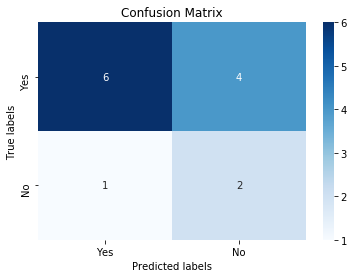

# jupyterlabel
> A library to label data in Jupyter Notebooks


## Why should you use this? 

Developing a deep understanding and intuition for a dataset is important for any Data Science or Machine Learning project. An underappreciated way of accomplishing this is to label data yourself.

When people think of Exploratory Data Analysis (EDA), plotting many beautiful graphs comes to mind. But eyeballing the data, coming up with heuristics, labeling the data, and evaluting those heuristics are valuable too. At worst you learn a lot about your dataset and at best you realize your heuristic is good enough you may not even need to resort to an ML model!

jupyterlabel aims to streamline this process.

## Installation 

`pip install jupyterlabel`

## Usage 

### Load dataset

Load dataset containing at least one target variable into a pandas dataframe. 

```python
import pandas as pd
from IPython.display import Image

from jupyterlabel import jupyterlabel as labeler
```

```python
input_file = '../data/FIFA 2018 Statistics.csv'
df = pd.read_csv(input_file)
df.columns
```


    Index(['Date', 'Team', 'Opponent', 'Goal Scored', 'Ball Possession %',
           'Attempts', 'On-Target', 'Off-Target', 'Blocked', 'Corners', 'Offsides',
           'Free Kicks', 'Saves', 'Pass Accuracy %', 'Passes',
           'Distance Covered (Kms)', 'Fouls Committed', 'Yellow Card',
           'Yellow & Red', 'Red', 'Man of the Match', '1st Goal', 'Round', 'PSO',
           'Goals in PSO', 'Own goals', 'Own goal Time'],
          dtype='object')


### Define features and target variable to explore

If the target variable is continuous, you'll want to bucket the values since jupyterlabel only supports explicit labels for target variables.

```python
target_var = 'Man of the Match'
features = [
    'Goal Scored', 'Ball Possession %',
    'On-Target', 'Off-Target',
    'Blocked',
    'Corners',
    'Offsides', 
    'Free Kicks', 
    'Saves',
    'Pass Accuracy %',
    'Passes'
]
labeler = labeler.Labeler(df, target_var, features=features)
```

### Label data one row at a time

```python
with labeler as l:
    l()
```

    Valid options: Yes, No, save
    Total samples labeled: 13/128


<div>
<style scoped>
    .dataframe tbody tr th:only-of-type {
        vertical-align: middle;
    }

    .dataframe tbody tr th {
        vertical-align: top;
    }

    .dataframe thead th {
        text-align: right;
    }
</style>
<table border="1" class="dataframe">
  <thead>
    <tr style="text-align: right;">
      <th></th>
      <th>Goal Scored</th>
      <th>Ball Possession %</th>
      <th>On-Target</th>
      <th>Off-Target</th>
      <th>Blocked</th>
      <th>Corners</th>
      <th>Offsides</th>
      <th>Free Kicks</th>
      <th>Saves</th>
      <th>Pass Accuracy %</th>
      <th>Passes</th>
    </tr>
  </thead>
  <tbody>
    <tr>
      <th>118</th>
      <td>2</td>
      <td>38</td>
      <td>7</td>
      <td>4</td>
      <td>2</td>
      <td>6</td>
      <td>1</td>
      <td>18</td>
      <td>1</td>
      <td>69</td>
      <td>399</td>
    </tr>
  </tbody>
</table>
</div>


    Enter option: save





```python
Image(filename="../images/jupyterlabel.gif.png")
```


